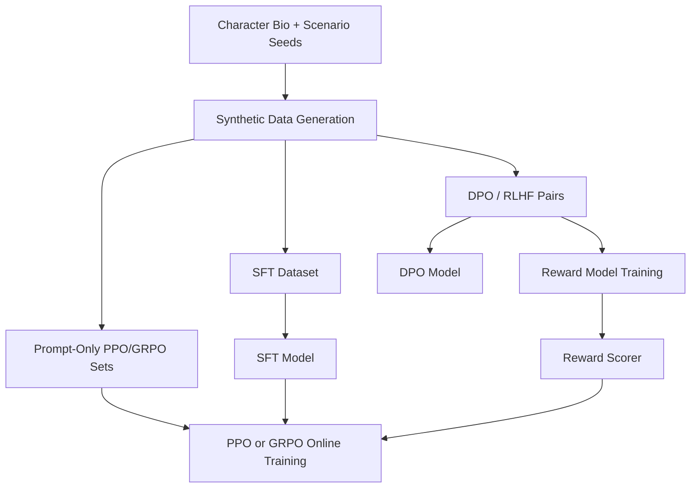

# Love Game Training Explainer

> Historical note: this file captured the mid-project state before the final H200 runs completed. For the finished Love Game training results, use [LOVE_GAME_DEEP_REPORT.md](/Users/sanju/Desktop/coding/python/open-env-meta/love_game/reports/LOVE_GAME_DEEP_REPORT.md).

## Live Status

As of this snapshot:

- The H200 is **idle right now**.
- The last completed big run was **SFT on the larger Love Game corpus**.
- The last completed preference run was **DPO** on the smaller earlier split.
- We have a **toy reward model** and **RL-shaped datasets**, but we have **not yet run a full Love Game PPO or GRPO training loop** end to end.

That means the project is currently in this state:

| Piece | Status | Real or scaffold? |
|---|---|---|
| SFT dataset | Built | Real |
| DPO dataset | Built | Real |
| Reward-model dataset | Built | Real |
| Reward model | Trained | Real, but simple |
| PPO prompt dataset | Built | Scaffold for PPO |
| GRPO prompt dataset | Built | Scaffold for GRPO |
| Full PPO training run | Not done yet | Not yet real |
| Full GRPO training run | Not done yet | Not yet real |

## The Big Picture

The easiest way to explain the project is:

1. **SFT teaches the model what good replies look like.**
2. **DPO teaches the model which of two replies is better.**
3. **Reward modeling teaches a separate scorer what “good” means.**
4. **PPO/GRPO use that scorer or verifier during online RL.**

## Why SFT Looks Different From DPO

### SFT

In SFT, each row is:

- prompt
- completion

That means the model sees:

```text
Prompt -> one target answer
```

So SFT is just imitation learning.

### DPO

In DPO, each row is:

- prompt
- chosen
- rejected

That means the model sees:

```text
Prompt -> better answer vs worse answer
```

So DPO is not trying to copy one exact target. It is trying to prefer the `chosen` response over the `rejected` response.

That is why the DPO dataset viewer looks more intuitive for preference training.

## What RLHF Actually Means

`RLHF` is an umbrella term, not one single algorithm.

It usually means some version of:

1. collect demonstrations or preference data
2. train a reward model from preferences
3. run RL against that reward model

So these are related but different:

| Term | What it means |
|---|---|
| `SFT` | Supervised imitation on prompt -> answer |
| `DPO` | Preference optimization directly on chosen vs rejected |
| `Reward model` | A separate model that scores responses |
| `PPO` | An RL algorithm that uses a reward signal |
| `GRPO` | A grouped RL algorithm that compares sampled outputs |
| `RLHF` | The broader recipe around reward learning + RL |

## What We Have Actually Implemented

### 1. SFT

Implemented in:

- [run_sft_full.py](/Users/sanju/Desktop/coding/python/open-env-meta/love_game/run_sft_full.py)

What it does:

- loads prompt/completion JSONL
- tokenizes prompt + completion
- masks the prompt tokens in the labels
- trains the full `SmolLM2-135M-Instruct` weights

So SFT is fully real in this repo.

### 2. DPO

Implemented in:

- [run_dpo_full.py](/Users/sanju/Desktop/coding/python/open-env-meta/love_game/run_dpo_full.py)

What it does:

- loads prompt / preferred_response / dispreferred_response
- maps those into prompt / chosen / rejected
- uses TRL `DPOTrainer`
- trains the model to score the preferred answer above the rejected answer

Important point:

**DPO does not need a separate reward model.**

That is one reason DPO is so nice for teaching and demos.

### 3. Reward model

Implemented in:

- [train_reward_model.py](/Users/sanju/Desktop/coding/python/open-env-meta/love_game/train_reward_model.py)

What it does:

- builds a tiny bag-of-words logistic classifier
- trains it on pointwise good vs bad responses
- also checks pairwise preference accuracy

Important point:

This is a **toy reward model**, not a strong neural reward model.

It is good for teaching:

- what reward modeling is
- how pairwise preference data turns into a scorer

It is not yet good enough to be our final Love Game RL judge.

### 4. PPO / GRPO scaffolding

Prepared by:

- [prepare_training_sets.py](/Users/sanju/Desktop/coding/python/open-env-meta/love_game/prepare_training_sets.py)
- [reward.py](/Users/sanju/Desktop/coding/python/open-env-meta/love_game/reward.py)

What exists:

- `ppo_prompts.jsonl`
- `grpo_prompts.jsonl`
- a simple rule-based reward function
- a simple learned reward model

What does **not** exist yet:

- a real Love Game `run_ppo.py`
- a real Love Game `run_grpo.py`
- an online rollout loop that samples fresh responses and updates the model from reward

So the RL side is conceptually prepared, but not yet fully executed.

## What Grades PPO and GRPO?

This is the core confusion, and it is a good one.

### PPO

PPO usually needs:

- a prompt dataset
- a policy model
- a reward signal

That reward signal can come from:

1. a **learned reward model**
2. a **rule-based reward function**
3. sometimes a hybrid of both

For Love Game right now, the possible graders are:

- the simple rule-based scorer in [reward.py](/Users/sanju/Desktop/coding/python/open-env-meta/love_game/reward.py)
- the simple learned scorer in [reward_model.json](/Users/sanju/Desktop/coding/python/open-env-meta/love_game/models/reward_model.json)

But we have not yet plugged either one into a full PPO training loop.

### GRPO

GRPO also needs a reward signal, but it works differently from PPO.

Instead of just taking one answer and one reward, it often:

1. samples a group of candidate responses
2. scores each one
3. compares them relative to each other
4. updates the policy toward the higher-reward samples

For Love Game, the grader for GRPO would again be either:

- a rule-based reward function
- or a learned reward model

At the moment, we have candidate data and reward scaffolding, but not a finished Love Game GRPO trainer.

## Why The Current Reward Model Is Not Enough Yet

Our reward model is intentionally simple.

The rule-based scorer in [reward.py](/Users/sanju/Desktop/coding/python/open-env-meta/love_game/reward.py) mostly checks things like:

- warm words
- character markers like `bangalore`, `metro`, `jayanagar`, `whitefield`
- blandness penalties
- obvious contradictions

That is great for a classroom demonstration, but weak for serious emotional quality.

The learned reward model is also simple:

- bag-of-words features
- logistic regression style classifier

So it can tell some obvious differences, but it is not a deep reward model that truly understands tone or relationship nuance.

## Mermaid View



## What Happened On The H200

### Completed

- earlier small SFT run
- earlier small DPO run
- larger SFT run on the expanded dataset

### Not currently running

- no SFT active now
- no DPO active now
- no reward-model training active now
- no PPO active now
- no GRPO active now

So if someone asks “is RL running on the H200 right now?” the honest answer is:

**no, not at this exact moment.**

## Current Dataset State

Latest row counts on the pod:

| File | Rows |
|---|---:|
| `sft_train.jsonl` | 756 |
| `dpo_train.jsonl` | 135 |
| `rl_train.jsonl` | 135 |
| `ppo_prompts.jsonl` | 180 |
| `grpo_prompts.jsonl` | 135 |
| `rm_pointwise_train.jsonl` | 270 |
| `rlhf_pairs_train.jsonl` | 135 |

The most expanded corpus right now is the SFT side. The preference and RL-shaped datasets are still much smaller.

## How I Would Explain This In A Talk

### SFT

“Here I show the model examples of what a good reply looks like, and it learns to imitate them.”

### DPO

“Here I show the model two replies and say which one is better. The model learns preferences directly, without separately training a reward model first.”

### Reward model

“Here I train a separate judge to score responses. This is the part that tries to turn messy human taste into a number.”

### PPO / GRPO

“Here the model stops only copying examples and starts generating its own answers, getting rewarded or penalized, and updating itself from that signal.”

## The Most Important Honest Caveat

Right now, this repo proves:

- SFT works
- DPO works
- reward-model scaffolding works

But it does **not yet prove**:

- high-quality Love Game PPO
- high-quality Love Game GRPO
- a strong emotionally nuanced reward model

That is the main difference between “we have RL datasets” and “we have a strong RL system.”

## What To Do Next

The clean next milestone is:

1. scale `dpo_train.jsonl` and `rlhf_pairs_train.jsonl`
2. scale `rm_pointwise_train.jsonl`
3. train a stronger reward model
4. implement a real `run_ppo.py` or `run_grpo.py`
5. run online RL on the H200

If we do that, then the Love Game story becomes fully consistent:

- SFT for imitation
- DPO for preferences
- reward model for scoring
- PPO/GRPO for online RL
