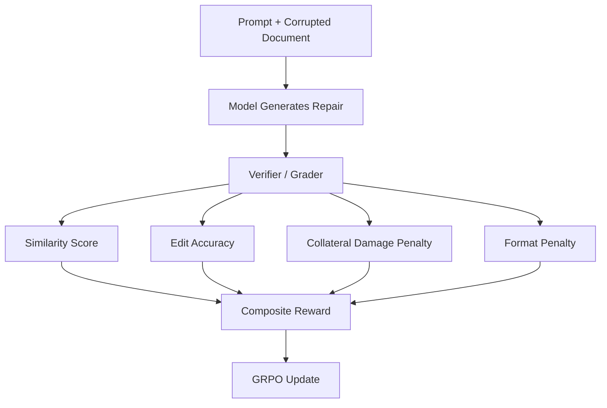
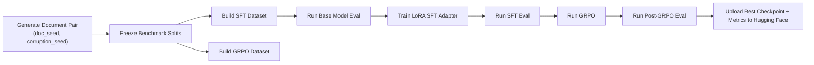
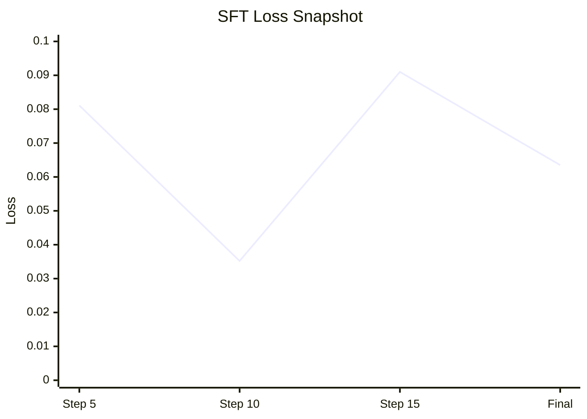
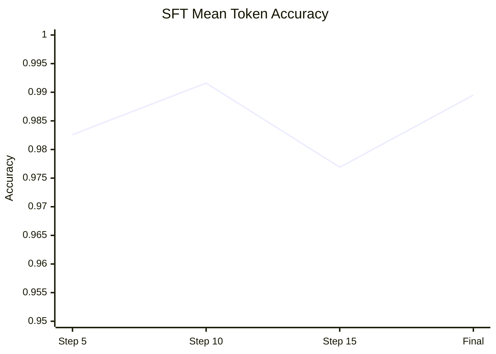
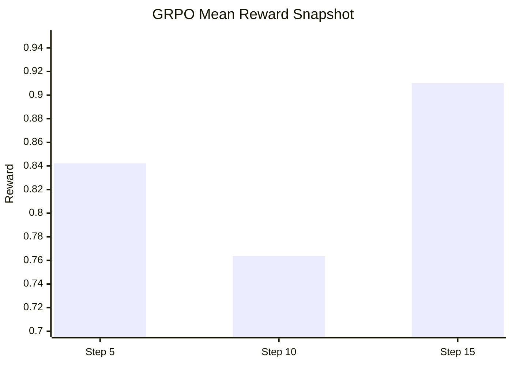
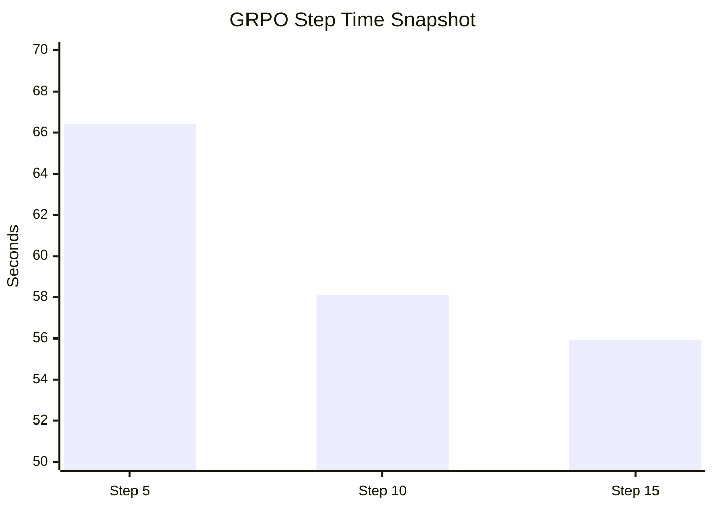

# DocEdit Training Walkthrough

This document is a presentation-friendly walkthrough of how we trained a document-editing model for the DocEdit Game.

Audience:
- students who know what an LLM is
- people who do not yet know the details of fine-tuning or reinforcement learning

Date of run:
- April 17, 2026

Hardware used:
- `1x H200 SXM`
- about `141 GB` VRAM

Base model used:
- `Qwen/Qwen2.5-3B-Instruct`

Training approach:
- `SFT` first
- then `GRPO`

---

## 1. The Big Idea

We are teaching a model to repair a corrupted structured document.

The task looks simple to a human:
- read a broken document
- read the editing instruction
- fix only the errors
- preserve everything else

But for a model, this is tricky because it must do **two things at once**:
- understand the language
- preserve the Word-like markup structure

That is why we split training into two stages:

1. `SFT` teaches the model the basic pattern:
   corrupted document + instruction -> repaired document
2. `GRPO` teaches the model to optimize for the actual game reward:
   fix more errors, break less formatting, and avoid collateral damage

---

## 2. What The Model Is Actually Learning

The model is not learning "English" from scratch.

It is learning a specialized behavior:
- read structured markup
- understand what changed
- infer what should be repaired
- return only the corrected markup

In other words, this is an **applicator model**.

It takes:
- a document
- an instruction
- sometimes extra metadata

And it outputs:
- the edited document

---

## 3. Why We Use SFT First

`SFT` means **Supervised Fine-Tuning**.

This is the "show the model the right answer" stage.

We already know:
- the corrupted source document
- the correct target document

So we can create direct examples of:

```text
Input: corrupted document + instruction
Output: repaired document
```

Why do this first?
- it is the fastest way to teach formatting discipline
- it reduces chaotic outputs
- it gives the model a sensible starting point before RL

Without SFT, GRPO has to spend time learning basic markup behavior instead of improving editing quality.

---

## 4. What SFT Data Looks Like

Each SFT training row is a simple example with:
- a `prompt`
- a `completion`
- metadata like seeds and difficulty

### SFT schema

```json
{
  "case_id": "train_legal_d1_00_doc100000_corr2378757",
  "prompt": "Instruction + corrupted document + output contract",
  "completion": "The repaired document markup",
  "doc_seed": 100000,
  "corruption_seed": 2378757,
  "difficulty": 1,
  "domain": "legal",
  "doc_type": "legal_contract",
  "instruction": "Fix the specified errors"
}
```

### Real SFT example from this run

```json
{
  "case_id": "train_legal_d1_00_doc100000_corr2378757",
  "prompt": "You are an expert Word-style document repair model...\nInstruction:\nFix 2 spelling error(s): 'corparation' -> 'corporation', 'Agremeent' -> 'AGREEMENT'. Fix 1 capitalization error(s)...\nCorrupted document:\n<heading level=\"1\" align=\"center\" bold=\"true\">SERVICE Agremeent</heading>\n<p align=\"justify\" ...>... a corparation organized under the LAWS of the State of California ...</p>\nOutput contract:\n- Return the repaired document only.",
  "completion": "<heading level=\"1\" align=\"center\" bold=\"true\">SERVICE AGREEMENT</heading>\n<p align=\"justify\" ...>... a corporation organized under the laws of the State of California ...</p>",
  "difficulty": 1,
  "domain": "legal"
}
```

### How to explain this to students

Say:

> In SFT, we are basically showing the model lots of worked examples.  
> We hand it a broken document and the exact correct repaired version.  
> The model learns the pattern by imitation.

---

## 5. What GRPO Data Looks Like

`GRPO` is different.

In GRPO, we do **not** give the model the final answer as the training target in the same direct way.

Instead, we give it:
- the prompt
- the original source
- the true target
- the corruption list

Then the model generates candidate outputs, and the verifier scores them.

### GRPO schema

```json
{
  "case_id": "train_legal_d1_00_doc100000_corr2378757",
  "prompt": "Instruction + corrupted document + output contract",
  "source": "The corrupted document",
  "target": "The correct repaired document",
  "instruction": "Fix the specified errors",
  "doc_seed": 100000,
  "corruption_seed": 2378757,
  "difficulty": 1,
  "domain": "legal",
  "doc_type": "legal_contract",
  "corruptions_json": "[...]"
}
```

### Real GRPO example from this run

```json
{
  "case_id": "train_legal_d1_00_doc100000_corr2378757",
  "prompt": "You are an expert Word-style document repair model...\nInstruction:\nFix 2 spelling error(s): 'corparation' -> 'corporation', 'Agremeent' -> 'AGREEMENT'. Fix 1 capitalization error(s)...",
  "source": "<heading ...>SERVICE Agremeent</heading> ... a corparation organized under the LAWS ...",
  "target": "<heading ...>SERVICE AGREEMENT</heading> ... a corporation organized under the laws ...",
  "corruptions_json": "[{\"type\":\"spelling\"...}, {\"type\":\"spelling\"...}, {\"type\":\"case\"...}]",
  "difficulty": 1,
  "domain": "legal"
}
```

### How to explain this to students

Say:

> In GRPO, the model is not just copying a teacher example.  
> It tries an answer, the game checks how good that answer is, and that score becomes the learning signal.

---

## 6. Why GRPO Instead Of RLHF Or DPO

This task is a great fit for **RLVR**: reinforcement learning from verifiable rewards.

Why?
- we know the corrupted source
- we know the correct target
- we can compute whether edits are right or wrong
- we can penalize collateral damage automatically

So we do **not** need a human to rank outputs for every step.

### Why not RLHF first?

`RLHF` is strongest when the task is subjective:
- tone
- preference
- helpfulness style

Our task is much more objective:
- did you fix the right text?
- did you preserve the rest?
- did you avoid damaging the markup?

### Why not DPO first?

`DPO` is great if we already have many pairs of:
- better output
- worse output

We could build that later, but tonight the simplest high-signal path is:
- SFT for warm start
- GRPO with the verifier

---

## 7. What The Reward Is Doing

Our GRPO stage uses reward components that come from the game logic.

Conceptually, the reward asks:
- how similar is the answer to the true repaired document?
- did the model fix the intended corruption?
- did it avoid breaking other content?
- did it obey the output format?

### Reward sketch



### Plain-English explanation

Say:

> The model gets rewarded for fixing the right things and punished for changing the wrong things.  
> That makes the game itself a training signal.

---

## 8. The End-To-End Training Pipeline



---

## 9. What LoRA Means Here

We did not retrain the entire 3B model.

We trained a **LoRA adapter**.

That means:
- the big original model stays mostly frozen
- we train a much smaller set of extra weights
- the adapter learns the task-specific behavior

This is why the output checkpoint is small enough to move around easily.

### Real artifact size from this run

The SFT adapter file is about:
- `119.8 MB` for `adapter_model.safetensors`

That is presentation-friendly because you can tell students:

> We adapted a 3B model, but we only had to save a small task-specific patch instead of a whole giant model.

---

## 10. Real Metrics From This Run

## SFT training snapshot

Observed on the H200:
- full SFT run time: about `109.38 seconds`
- train steps: `18`
- final train loss: `0.0635`
- final mean token accuracy: `0.9895`

### SFT loss chart



### SFT token accuracy chart



## GRPO live snapshot

Observed on the H200:
- GRPO is running at roughly `58s` to `66s` per logged step early on
- first logged reward mean: about `0.8422`
- second logged reward mean: about `0.7638`
- third logged reward mean: about `0.9102`
- current live status during this write-up:
  - `15 / 100` steps completed
  - about `33.5 GB` VRAM in use
  - about `70%` GPU utilization
- first three logged loss values:
  - step 5: `0.0030`
  - step 10: `0.0423`
  - step 15: `0.0341`

### GRPO reward chart



### GRPO step time chart



### Important note for the talk

Do not overclaim early GRPO logs.

Say:

> RL is noisier than SFT.  
> Early reward curves move around, and that is normal.  
> What matters is whether the post-RL evaluation improves on held-out cases.

---

## 11. Baseline Vs LoRA: How To Explain The Comparison

We ran a very small smoke evaluation on two validation cases.

### Real smoke comparison

| Model | Cases | Mean similarity | Mean composite | Mean edit accuracy | Mean collateral damage |
|---|---:|---:|---:|---:|---:|
| Base `Qwen2.5-3B-Instruct` | 2 | 0.9947 | 0.87235 | 0.50 | 0.00 |
| SFT LoRA adapter | 2 | 0.98565 | 0.8619 | 0.50 | 0.0238 |

### How to explain this honestly

Say:

> On a tiny smoke test, the SFT adapter loaded and ran correctly, but it did not yet beat the base model.  
> That is exactly why the next stage is RL: we want the verifier to push the adapter toward the real task reward.

This is a strong teaching point because it shows:
- training is real engineering, not magic
- the first fine-tune is not always better
- evaluation matters

---

## 12. Where To Put Screenshots In Slides

Here is a simple slide order.

### Slide 1: The problem

Add:
- screenshot of the corrupted source document UI
- screenshot of the working draft UI

Say:
- the model must fix local errors without damaging the structure

### Slide 2: What one training example looks like

Add:
- one cropped prompt snippet
- one cropped repaired output snippet

Say:
- SFT is imitation learning from worked examples

### Slide 3: SFT vs GRPO

Add:
- the SFT/GRPO flow diagram from this markdown

Say:
- SFT teaches the format
- GRPO teaches optimization against the verifier

### Slide 4: Reward

Add:
- reward flow diagram

Say:
- we reward correct repairs and punish collateral damage

### Slide 5: Live metrics

Add:
- SFT loss chart
- GRPO reward chart

Say:
- this is a real run from the H200, not a mockup

### Slide 6: Baseline vs tuned model

Add:
- the smoke evaluation table

Say:
- we compare base model, SFT adapter, and then SFT+GRPO

---

## 13. How A Machine Learning Engineer Would Run This

This is the practical workflow.

1. Freeze the benchmark first.
2. Keep document generation reproducible with `doc_seed` and `corruption_seed`.
3. Train the smallest model that can demonstrate the behavior.
4. Run a base-model benchmark before any fine-tuning.
5. Run SFT and save a LoRA adapter.
6. Benchmark the adapter immediately.
7. Run GRPO only after the SFT pipeline is stable.
8. Save intermediate checkpoints and metrics.
9. Upload every major checkpoint to one Hugging Face repo.
10. Report results on held-out validation, not just on training examples.

This is important because it prevents:
- data leakage
- demo-only cherry-picking
- confusing training progress with real task improvement

---

## 14. Recommended Hugging Face Repository Layout

Use one repository for all related checkpoint artifacts.

Suggested structure:

```text
sanjuhs/docedit-qwen25-3b-checkpoints/
  README.md
  metrics/
    smoke_eval_base.jsonl
    smoke_eval_sft.jsonl
  qwen25_3b_sft/
    adapter_config.json
    adapter_model.safetensors
    tokenizer_config.json
    ...
  qwen25_3b_grpo/
    checkpoint-25/
    checkpoint-50/
    final/
```

Why one repo?
- easy to present
- easy to compare versions
- easy to show progression from SFT to GRPO

Live repo for this run:
- [sanjuhs/docedit-qwen25-3b-checkpoints](https://huggingface.co/sanjuhs/docedit-qwen25-3b-checkpoints)

---

## 15. What To Say If Someone Asks "Why Not Just Use GPT-5.4?"

Good answer:

> GPT-5.4 is our strong baseline and quality ceiling, but the research question is whether we can train a smaller, cheaper open model to become specialized for this exact document-repair task.

That gives you:
- a practical deployment story
- a benchmarking story
- a training story

---

## 16. Short Presentation Script

Here is a simple script you can say out loud.

> We built a game where a model has to repair corrupted Word-style documents.  
> First we generate paired examples: a broken document and its correct version.  
> Then we fine-tune a base language model with supervised learning so it learns the structure of the task.  
> After that, we use GRPO, which is reinforcement learning driven by the game’s verifier.  
> The verifier checks whether the model fixed the right errors, preserved the rest of the document, and avoided collateral damage.  
> That lets us train on a reward signal without needing humans to rank every output.  
> Finally, we compare the base model, the LoRA-adapted model, and the RL-improved model on a frozen benchmark.

---

## 17. Files To Reference During The Demo

- Training plan: [DOCEDIT_TRAINING_PLAN.md](/Users/sanju/Desktop/coding/python/open-env-meta/training/DOCEDIT_TRAINING_PLAN.md)
- SFT builder: [build_sft_dataset.py](/Users/sanju/Desktop/coding/python/open-env-meta/training/build_sft_dataset.py)
- SFT runner: [run_sft.py](/Users/sanju/Desktop/coding/python/open-env-meta/training/run_sft.py)
- GRPO runner: [run_grpo.py](/Users/sanju/Desktop/coding/python/open-env-meta/training/run_grpo.py)
- Eval runner: [run_eval.py](/Users/sanju/Desktop/coding/python/open-env-meta/training/run_eval.py)
- Reward helpers: [docedit_training.py](/Users/sanju/Desktop/coding/python/open-env-meta/training/docedit_training.py)

---

## 18. Final Takeaway

The clean story is:
- generate reproducible tasks
- teach the model by imitation with SFT
- improve task behavior with verifier-based RL
- compare against a strong baseline
- publish checkpoints and metrics transparently

That is the simplest honest story to tell tomorrow.
